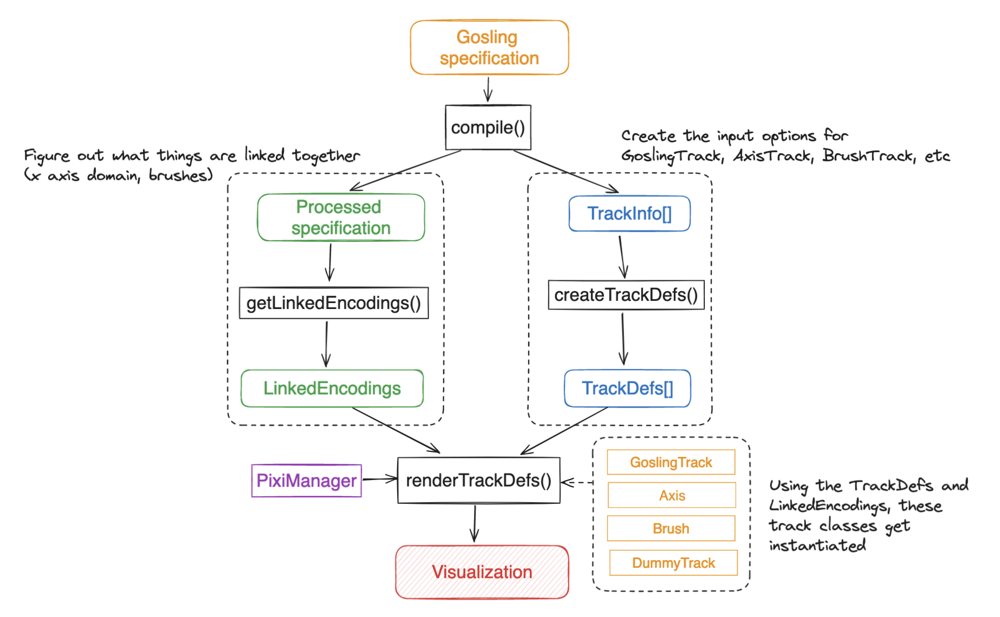

# How Gosling works

Gosling contains two main components:
1. A language for specifying genomic visualizations, a Gosling specification. 
2. A renderer which take a Gosling specification and renders it to the screen

Potentially there could be many renderers for Gosling, but currently there is only one which is implemented in this repository. It relies on PixiJS, a WebGL 2D graphics rendering library.

Here is a diagram which captures the inner workings of the renderer at a high level: 



After a user creates a Gosling specification, the following sequence of events occur: 

1. Gosling specification is compiled. This creates a processed Gosling specification and bounding boxes for each of the tracks.  
2. Using the processed specification, identify which features are shared between tracks. We call these linked encodings
3. From the compiled specification, generate options for each class associated with each type of track. 
4. Using the linked encodings and the track definitions, instantiate track classes which render the the visualization to the screen. 

# Definitions

There are many concepts that are frequently used in Gosling. Feel free to skip this on a first read. 

Track: A track is a data visualization which has an domain with genomic coordinates, a “genomic axis”. Typically, all tracks will have an x-domain with genomic coordinates. Some tracks, like a heatmap track, also contain a genomic y-domain. 

View: A view is a collection of tracks, usually adjacent to each other. The view defines things for the tracks within it.

A *track class* is a class which corresponds to a certain visual element, such as an axis or a plot. Note that this is different from a *track*. Multiple track classes may be needed to render a single track, for example, it is common for a single track to correspond to a GoslingTrack and a AxisTrack. Here are all of the track classes: 

- GoslingTrack
- HeatmapTrack
- AxisTrack
- BrushLinearTrack
- BrushCircularTrack
- DummyTrack

Track classes commonly use PixiJS, a WebGl 2D graphics rendering library. 

A *processed spec* refers to a Gosling specification which has been compiled (the resulting specification after running `compile()`). Unlike the Gosling specification, many properties in the processed spec are always defined, such as track `id`. Thus the type associated with this processed spec is different from a Gosling spec, although they resemble each other. Each track in the processed spec has the type `ProcessedTrack`. 

A *track definition*, or `TrackDef`, contains all of the information (besides domain signals) to render a single track to the canvas. There are two main components to a TrackDef: a bounding box, and the options for the corresponding track class. 

```jsx
export interface TrackDef<T> {
    type: TrackType;
    trackId: string;
    boundingBox: { x: number; y: number; width: number; height: number };
    options: T;
}
```

A *linked encoding*, or `LinkedEncoding` , is an object containing a signal and information about which encodings in classes use that signal. Track class instances will use the appropriate signal found in a linked encoding. 

```jsx
interface LinkedEncoding {
    linkingId: string;
    signal: Signal;
    tracks: {
        id: string;
        encoding: 'x' | 'y' | 'brush';
    }[];
}
```

## Linking between tracks

### How are tracks linked together

Gosling relies on *Signals* to share state between tracks such as x-axis domain. An explanation of signals can be found [here](https://preactjs.com/blog/introducing-signals/). 

Let’s take a look a what happens when a user zooms into a track. When a user zooms in on a track, the x-domain of the track will change. If other tracks share the same x-domain signal, they will also get zoomed in. This is because each track contains an `effect` which updates the track scales when the signal changes.

Currently signals are used to link the genomic x- and y-domains of tracks, as well as brushes. 

### Creating linked encodings

From a processed Gosling specification, we identify which encodings are linked and create signals for them.

**Creating x and y domain signals**

Tracks that are in the same view share the same x-axis and y-axis genomic domain and therefore the same signal. There are two exceptions to this:

1. Track has a `linkingId` which is different from the `linkingId` defined in the view
2. Track has a `domain` defined in the `x` encoding which is different from the `xDomain` defined in the view 

Views can also receive a `linkingId` property. Tracks which share the same `linkingId` in their genomic x- or y-encoding will share the same x-domain as the the view. 

## Creating track definitions

From `compile()` we receive a list of `TrackInfo` objects. Each object contains a `ProcessedTrack` and a bounding box (x, y, width, height). We want to use this information to generate the options for each track class. 

Let’s look at an example to get a better understanding: 

Here is a single `ProcessedTrack` that a `TrackInfo` might contain: 

```jsx
{
  _overlay: [{ mark: "brush", x: { linkingId: "brush" } }],
  x: { axis: "top", field: "x", type: "genomic" },
  y: { axis: "left", field: "y", type: "quantitative" },
  mark: "point",
  ...
};
```

For this single `ProcessedTrack`, we need to generate options for three different track classes

- GoslingTrack, since we have a point mark.
- AxisTrack, since there the `x` encoding specifies axis on the top.
- BrushTrack, since the track has an an `_overlay` containing a brush track.

# Compiler Improvements

Here are a list of things that I think could be improved on the Gosling compiler. 

The original purpose of the Gosling compiler was to convert a Gosling spec to a HiGlass spec. But since then, the purpose of the compiler has evolved. 

1. **Fix: Better bounding boxes for overlaid tracks:** Tracks can be overlaid on top of each other. When a track has a x-axis, the height is increased by 30px. However, the (x,y) position of every overlaid track is the same regardless of whether there is an x-axis or not. This is makes the (x,y) of the bounding box incorrect. The current workaround is to require that overlaid tracks define an axis in the same way. 
2. **Refactor: types for final compiled spec**: Currently I have something called “ProcessedTrack” which begins to capture the final representation of a track. This needs to be made more complete to ensure that we can accurately generate track definitions. The final representation is similar to a Gosling spec but with some required properties and some new properties. **Benefit: Makes generating options from compiled spec more robust.** 
3. **Refactor: types for intermediate representations**: There are not good types for the intermediate representations used in the compiler due to the ad hoc development of the compiler. This makes working on the compiler much more difficult. **Benefit: Improved develop experience. Do this before adding support for plug-in tracks.** 
4. **Feat: Support for plug-in tracks**: We want the compiler to also support plug-in tracks. i.e. user creates a gosling spec which contains typical Gosling tracks but also 
5. **Refactor: Remove HiGlass spec**: We do not rely on HiGlass to for rendering, there are parts of the compiler that are unneeded.
